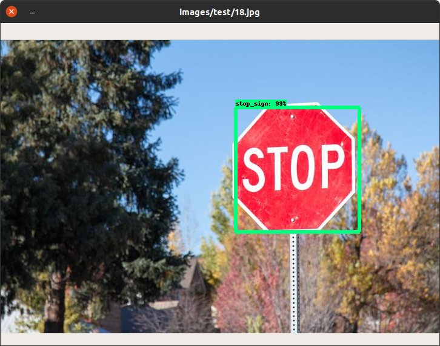

# street-sign-detector



An application using Tensorflow to detect selected street signs on provided images.

Currently detected signs:
- stop

Signs planned to be detected:
- no stopping
- no entry

## Dependencies

`pycocotools` needs `gcc` to build, so first we need to install it:

```sh
sudo apt-get install build-essential
```

then we proceed to install Python requirements:

```sh
pip3 install Cython
pip3 install -r requirements.txt
pip3 install pycocotools
```

> `Cython` must be installed before requirements, `pycocotools` after.
> Weird, but have to cope with it.

## Usage

Launch `app.py` script and pass images which you want to detect street signs on:

```sh
./app.py *.jpg
```

> Keep pressing `Enter` to show next image.

## Development

Below steps present what it takes to add new images to dataset and retrain the model.

### Install `labelImg`

```sh
pip3 install labelImg 
```

### Download images

Fetch images of signs to `images/` directory. Be sure they are all with `.jpg` extension and please follow the naming convention.

### Label images

Launch:

```sh
labelImg images/ annotations/labels.txt
```

If a dialog pops up, to select annotations directory, choose `images/`.

Correctly select street signs on new images and assign labels to them properly.

### Before training

Run:

```sh
./pre-train.py
```

What this script does:
- generate labels text file
- generate labels map file
- partition images into train and test sets
- convert `.xml` files to `.csv`
- convert `.csv` files to `.record`

### Train model

This can take very long time. You will also observe lots of deprecation warnings and other outputs, but don't worry about it.

Total loss should be between `1` and `2`, if it is, you can just interrupt (`Ctrl-C` ) the script after checkpoint is reached.

```sh
./train.py
```

### After training

Run below script to export inference graph, that said, finalize the whole training process.

```sh
./post-train.py
```

When this is completed, you can run `app.py` to test new model.

## References

- https://tensorflow-object-detection-api-tutorial.readthedocs.io/en/latest/index.html
- https://medium.com/@teyou21/training-your-object-detection-model-on-tensorflow-part-2-e9e12714bdf
- https://github.com/EdjeElectronics/TensorFlow-Object-Detection-API-Tutorial-Train-Multiple-Objects-Windows-10
- https://github.com/GoogleCloudPlatform/tensorflow-object-detection-example
- https://github.com/tzutalin/labelImg
